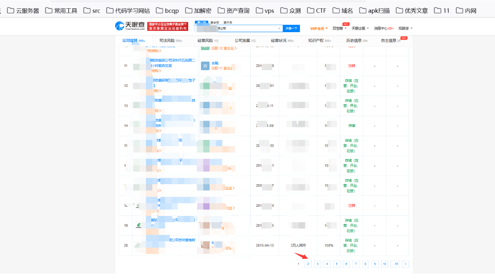
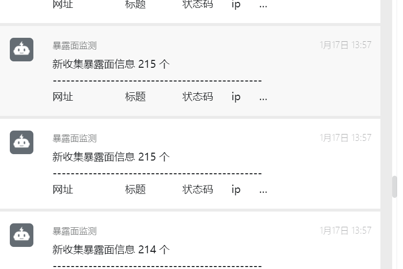
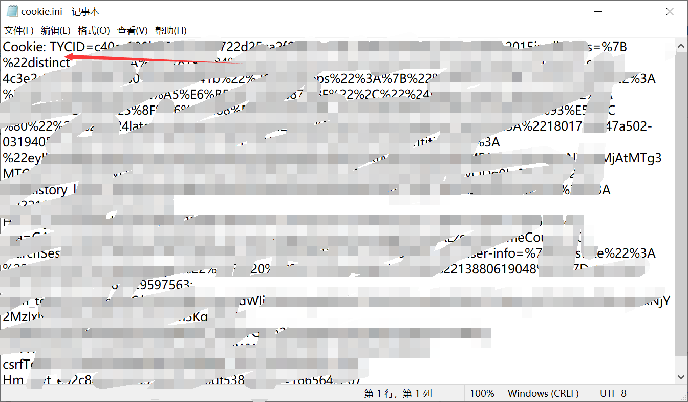
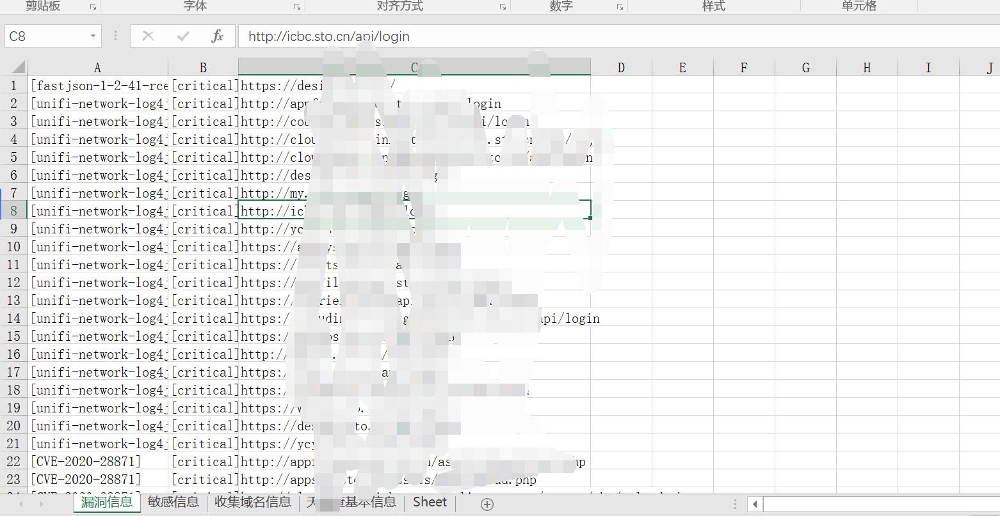
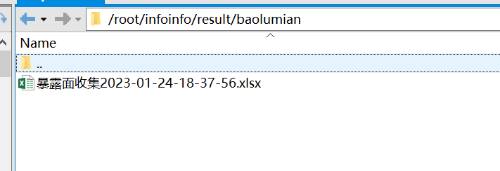

# tyz_fofa_yt_getinfo

基于天眼查和爬虫,批量获取目标公司以及它子公司(包括子公司的子公司)的域名地址,邮箱等信息。


# 使用参数

* -c : 对单个目标进行扫描。

* -l :  对多个目标进行批量扫描。 

* -o: 设置占用率(默认为100)

* -d: 额外添加域名

  

# 快速开始

在配置文件中写入COOKIE信息,如果只是爬取公司单页数据,无需cookie,cookie抓取按如下操作:

1.登陆天眼查后,随意查询一个公司,在在该公司的股权图中,在点击除第一页页码外的页码抓取包中,获取cookie,直接复制到cookie.ini中即可。



2.使用抓包软件将cookie抓取直接放入cookie.ini中：





配置config,这里鹰图你有多少就添加多少就行



3.使用如下命令即可开跑。

```shell
 python3 Tyz_Get_Info.py -o(可填可不填) 数值  -r test.txt
```

```
 python3 Tyz_Get_Info.py -o(可填可不填) 数值  -c "公司名或网址"
```


# 安装库



# 使用说明

运行代码前需要添加cookie信息,直接复制放进cookie.ini配置文件中,运行代码会在同一目录下生成一个company_url_lsit(包含所有域名信息,可利用子域名收集工具进一步探测),还有一个company_info_list,方便查看域名归属。

