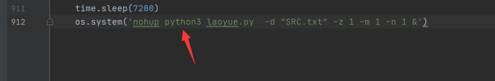
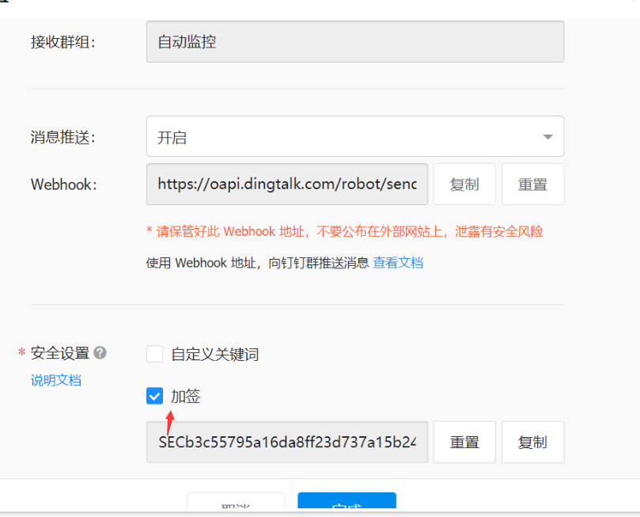
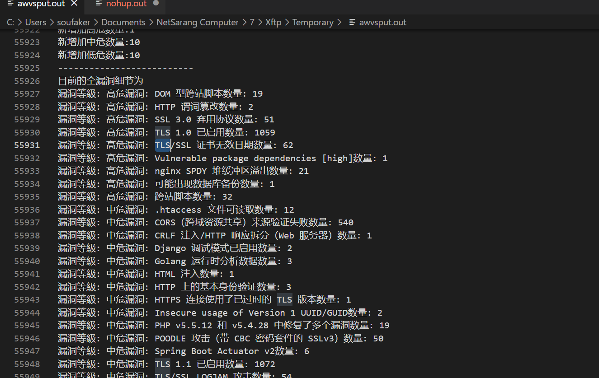
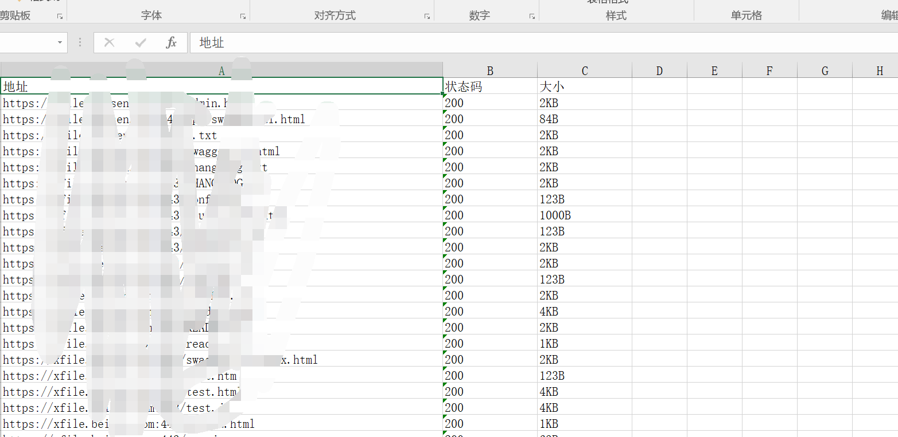
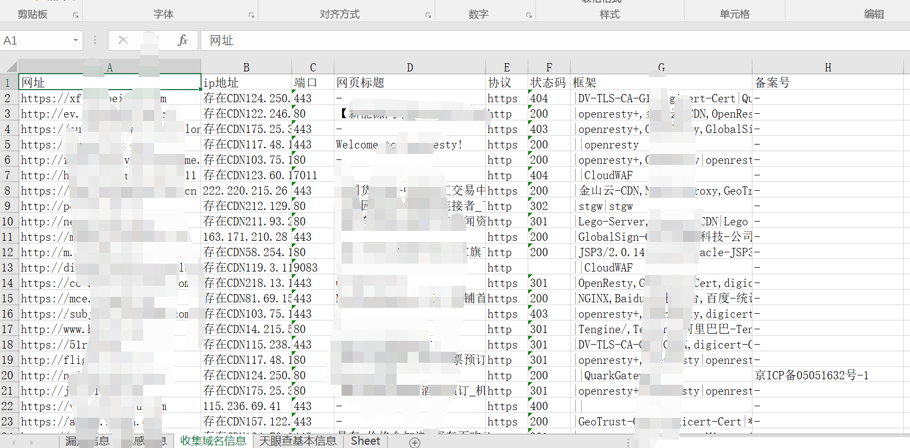
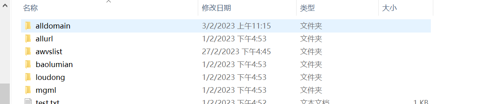

**声明：文中所涉及的技术、思路和工具仅供以安全为目的的学习交流使用，任何人不得将其用于非法用途以及盈利等目的，否则后果自行承担。**

# laoyue

一款自动化监控收集资产的工具,可以帮助你定期收获资产,敏感信息和漏洞信息。

# 使用参数

* -c : 调用某眼查接口进行公司资产收集。
* -l :  对多个公司目标进行批量收集。
* -x:  爬取单个公司下的子公司所有域名信息
* -o: 设置占用率(默认为100)
* -d: 扫描自己收集的域名列表
* -z: 不走某眼查接口,直接利用某fa,某图查询
* -n: 扫描漏洞
* -m: 扫描目录
* -a: 调用awvs进行扫描
* -f: 调用fscan扫描收集到的真实IP

# 声明
-c参数已经无法使用,请自行收集域名然后使用3，6，7，8，9，10命令

# 快速开始

1.使用git拉取项目到vps(centos7)服务器,python环境要3.7以上

`git clone https://github.com/Soufaker/laoyue.git`

2.在config.ini中填入自己的各种key,包括某查的cookie,某fa的key,某图的key,钉钉的key(可以搞多个账号白嫖每天的500积分)


3.注意你自己使用的python3表示方式,有的师傅服务器python3用的是pyhon或者python3.x啥标识,自行更改build.sh中和laoyue.py中的python表示方式.默认为python3

4.使用chmod 777 biuld.sh加权限安装所需依赖

`./build.sh`

5.三种使用场景需要的命令(-c由于调用的某眼查 vps是会被墙的所以要跑就得先去国内服务器跑一下,等收集到域名在使用第3个命令监控就行了)

```
1.python3 laoyue.py -c "公司名" -o 50 -x 1 #爬取单个公司下的子公司所有域名信息可以在result/domain下查看（该功能目前存在问题,暂时使用）
```

```python
2.python3 laoyue.py  -c "公司名" -m  -n  -o 50 #使用于对单个公司及其之下的公司进行定期资产,敏感目录,漏洞扫描,国内使用可能被封
```

```python
3.python3 laoyue.py  -d "SRC.txt" -m  -n  -z  #对自己收集的域名进行定期资产,敏感目录,漏洞扫描(推荐使用这种,结合1命令和自己收集的资产全部放在SRC.txt里)
```

```python
4.python3 laoyue.py  -c "公司名" -d "SRC.txt" -m  -n   #对某查收集的域名信息和自己收集的域名进行定期资产,敏感目录,漏洞扫描,国内使用可能被封
```

6.后台使用直接使用(基于1,3命令组合使用)nohup就行了如下

```python
 nohup python3 laoyue.py -d "SRC.txt" -m  -n -z  &
```

7.代码默认跑的自己收集的域名资产循环,如果使用其他命令可以自行更改循环



8.新增加awvs配合扫描,只需要添加参数-a就行了,也可以单独运行/目前我使用的自动化参数

`nohup python3 laoyue.py -d "SRC.txt" -m  -n -z -a  &`

或`nohup python3 awvs_monitor.py >awvsput.out 2>&1 &`

9.如果钉钉配置有问题发不了消息,请设置如下,别自定义关键字,加签就行



10.新增加fscan对收集的真实IP进行扫描播报,只需要添加参数-f就行了,目前我使用的自动化参数

`nohup python3 laoyue.py -d "SRC.txt" -m  -n -z -a -f `&


11.新增自动化定时检测是否卡死的功能代码,请在执行上述自动化指令后手动执行该代码(运行该命令之前,请先运行build.sh文件或者手动在shell执行命令:sed -i "s/\r//" check_nohup_size.sh,定时检查nohup.out是否变化防止卡死导致自动化停止)

```
nohup ./check_nohup_size.sh >check_size.out 2>&1 &
```

# **效果展示**

1.钉钉的信息

新增暴露面资产如图


敏感信息如图


漏洞信息

awvs



2.服务器目录下生成文件信息

1.一个总的excel






2.单独想看某项的话也可以在单个目录里去看


