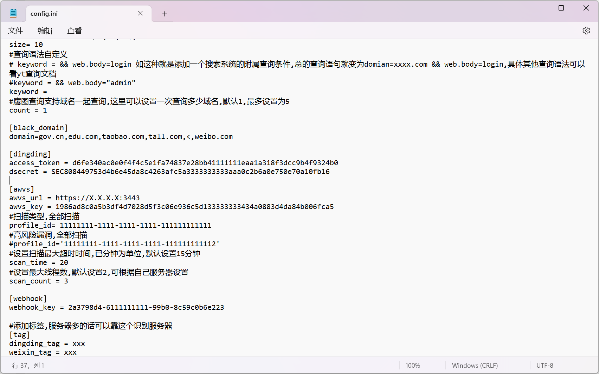

# laoyue

一款自动化监控收集资产的工具,可以帮助你定期收获资产,敏感信息和漏洞信息。


# 使用参数

* -c : 调用某眼查接口进行公司资产收集。

* -l :  对多个公司目标进行批量收集。 

* -o: 设置占用率(默认为100)

* -d: 扫描自己收集的域名列表

* -z: 设置为1,不走某眼查接口,直接利用某fa,某图查询

* -n: 设置值为1,扫描漏洞

* -m: 设置值为1,扫描目录

  
  
  

# 快速开始

1.使用git拉取项目到vps(centos)服务器

`git clone https://github.com/Soufaker/laoyue.git`

2.在config.ini中填入自己的各种key,包括某查的cookie,某fa的key,某图的key,钉钉的key(可以搞多个账号白嫖每天的500积分)



3.注意你自己使用的python3表示方式,有的师傅服务器python3用的是pyhon或者python3.x啥标识,自行更改build.sh中和laoyue.py中的python表示方式.默认为python3

4.使用biuld.sh安装所需依赖

`./build.sh`

5.三种使用场景需要的命令(-c由于调用的某眼查 vps是会被墙的所以要跑就得先去国内服务器跑一下,等收集到域名在使用第3个命令监控就行了)

```
1.python3 laoyue.py -c "公司名" -o 50 -x 1 #爬取单个公司下的子公司所有域名信息可以在result/domain下查看
```

```python
2.python3 laoyue.py  -c "公司名" -m 1 -n 1 -o 50 #使用于对单个公司及其之下的公司进行定期资产,敏感目录,漏洞扫描,国内使用可能被封
```

```python
3.python3 laoyue.py  -d "SRC.txt" -m 1 -n 1 -z 1 #对自己收集的域名进行定期资产,敏感目录,漏洞扫描(推荐使用这种,结合1命令和自己收集的资产全部放在SRC.txt里)
```

```python
4.python3 laoyue.py  -c "公司名" -d "SRC.txt" -m 1 -n 1  #对某查收集的域名信息和自己收集的域名进行定期资产,敏感目录,漏洞扫描,国内使用可能被封
```

6.后台使用直接使用(基于1,3命令组合使用)nohup就行了如下

```python
 nohup python3 laoyue.py -d "SRC.txt" -m 1 -n 1 -z 1 &
```

7.代码默认跑的自己收集的域名资产循环,如果使用其他命令可以自行更改循环


# 脚本运行展示


1.钉钉的信息

新增暴露面资产如图


敏感信息如图


漏洞信息

这个因为之前写代码忘记写发送了后面补上

2.服务器目录下生成文件信息

1.一个总的excel


2.单独想看某项的话也可以在单个目录里去看


