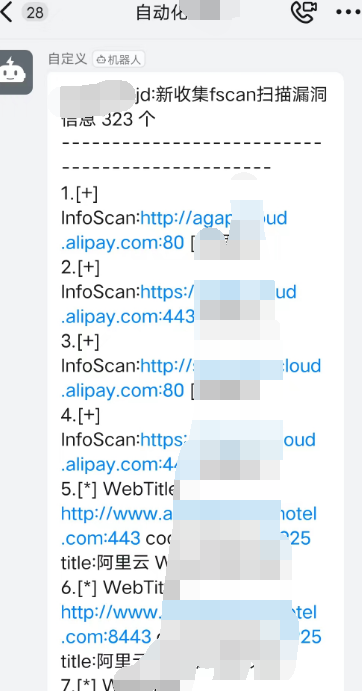

**声明：文中所涉及的技术、思路和工具仅供以安全为目的的学习交流使用，任何人不得将其用于非法用途以及盈利等目的，否则后果自行承担。**

```
   __                       
  / /__ ____  __ ____ _____ 
 / / _ `/ _ \/ // / // / -_)
/_/\_,_/\___/\_, /\_,_/\__/ 
            /___/          
```

一款自动化SRC监控赏金猎人项目，专为安全研究人员和赏金猎人设计，提供多种工具集成和自动化功能，加快漏洞发现和报告流程。

# 使用参数

```
-h, --help  : 显示帮助信息
-d, --domain: 指定单个域名或包含多个域名的文件（如：src.txt）。
-m, --ml    : 使用ffuf扫描目录。可在./inifile/dict目录下添加字典。
-n, --nl    : 使用nuclei进行漏洞扫描。
-f, --fs    : 使用fscan进行漏洞扫描。
-a, --av    : 使用awvs进行漏洞扫描。
-z, --hostz : 进行host碰撞。
-N, --notauto: 启用被动扫描模式，手动收集URL资产后使用。
```

# 声明
删除了之前的主域名收集接口,请自行收集要跑的SRC主域名

# 快速开始

1.使用git拉取项目到vps(centos7)服务器,python3即可,java需要1.8环境

`git clone https://github.com/Soufaker/laoyue.git`

2.在config.ini中填入自己的各种key,包括某查的cookie,某fa的key,某图的key,钉钉的key(可以搞多个账号白嫖每天的500积分)


3.注意你自己使用的python3表示方式,有的师傅服务器python3用的是pyhon或者python3.x啥标识,自行更改build.sh中和laoyue.py中的python表示方式.默认为python3

4.使用chmod 777 biuld.sh加权限安装所需依赖

`./build.sh`

5.常用命令如下:

```
常用自动化监控命令(可以先不加nohup手动测试一下看看能跑通不,能跑通就用下面的命令,可以自行增加删除参数,下面的是都跑一遍):
单域名扫描: nohup python3 laoyue.py -d example.com  -m -f -n -z -a  > laoyue.out 2>&1 &
多域名扫描: nohup python3 laoyue.py -d "SRC.txt"  -m -f -n -z -a  > laoyue.out 2>&1 &
被动扫描: nohup python3 laoyue.py -m -n -f -z -a -N &
```

6.新增自动化定时检测是否卡死的功能代码,请在执行上述自动化指令后手动执行该代码(运行该命令之前,请先运行build.sh文件或者手动在shell执行命令:sed -i "s/\r//" check_nohup_size.sh,定时检查nohup.out是否变化防止卡死导致自动化停止)

```
nohup ./check_nohup_size.sh >check_size.out 2>&1 &
```

# **效果展示**

1.新增暴露面资产如图


2.敏感信息如图


3.漏洞信息(awvs,fscan,nuclei)




4.服务器目录下生成文件信息

一个总的excel(./result/baolumian)


